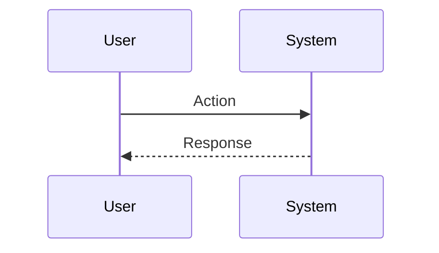

# PRD: [Project Name] [Doc Type]

## 文档归属说明

| 属性 | 内容 |
| :--- | :--- |
| **项目名称** | [Project Name] |
| **文档版本** | v1.0.0 (Draft/Stable) |
| **负责人** | [Owner Name] |
| **最后更新** | [Date] |
| **状态** | [Planning/In-Progress/Done] |
| **适用对象** | 研发, 设计, 运营 |

---

## 一、需求背景及分析 (Why)

### 1.1 需求背景
*   **现状痛点：** [描述当前的问题或痛点]
*   **机会点：** [描述为什么现在做这个，有什么机会]
*   **核心假设：** [列出核心假设，如"如果提供X功能，用户效率将提升Y%"]

### 1.2 产品目的
*   **战略角度：** [如何支持公司或产品的长期目标]
*   **产品角度：** [功能设计、差异化优势]
*   **用户角度：** [解决用户什么问题，提升什么体验]

### 1.3 用户故事地图 (User Story Map)
1.  **阶段一：** [用户行为/流程] -> [系统响应]
2.  **阶段二：** [用户行为/流程] -> [系统响应]
3.  **阶段三：** [用户行为/流程] -> [系统响应]

---

## 二、需求概览 (What)

### 2.1 明确需求目标
*   **核心指标 (OMTM):** [关键成功指标]
*   **质量指标:** [性能、准确率等要求]
*   **交付物:** [预期产出，如代码、文档、设计稿]

### 2.2 需求范围 (Scope)
*   **终端版本:** [Web/Mobile/Desktop, Supported Browsers/OS]
*   **包含 (In Scope):** [本次迭代包含的功能]
*   **不包含 (Out of Scope):** [本次迭代暂不涉及的功能]

### 2.3 需求清单 (Feature List)

| 模块 | 功能点 | 优先级 | 描述 |
| :--- | :--- | :--- | :--- |
| **[Module]** | [Feature Name] | P0/P1 | [简要描述] |
| **[Module]** | [Feature Name] | P0/P1 | [简要描述] |

### 2.4 资源协调
*   **设计资源:** [需要的支持]
*   **开发资源:** [需要的支持]

---

## 三、需求说明 (How)

### 3.1 核心流程图 (Architecture/Flow)

### 3.2 功能详解

#### 3.2.1 [功能名称]
*   **功能入口:** [哪里触发]
*   **输入参数:** [Arguments/Inputs]
*   **处理逻辑:**
    1.  [Step 1]
    2.  [Step 2]
*   **异常处理:** [Error Handling]
*   **交互逻辑:** [UI/UX Behavior]

### 3.3 数据加工说明 (Data Logic)
*   **数据源:** [Where data comes from]
*   **加工规则:** [How data is processed]

### 3.4 算法逻辑 (Algorithms/AI)
*   **System Prompt:** [If applicable]
*   **Model Strategy:** [If applicable]

---

## 四、埋点需求 (Data Tracking)

| 事件名称 | 触发条件 | 记录属性 | 分析目的 |
| :--- | :--- | :--- | :--- |
| `event_name` | [Trigger] | [Properties] | [Why track this] |

---

## 五、GTM 方案 (Go-to-Market)

### 5.1 发布计划
*   **Alpha:** [Date] - [Audience]
*   **Beta:** [Date] - [Audience]
*   **GA:** [Date] - [Audience]

### 5.2 用户触达
*   **核心卖点:** [Value Proposition]
*   **宣传物料:** [Docs, Videos, Posts]

---
**附件:**
*   [Link to File]
